<h3 align="center">Blockchain Testnet</h3>
<p align="center">
  <a href="https://github.com/bgregory0913/Blockchain_Testnet_Using_Python">
    
  </a>
</p>

[Photo by Bram van Oosterhout from Pexels](https://www.pexels.com/photo/internet-farm-technology-display-6478886/)


# Project Purpose:

This project demonstrates how to develop a test Blockchain network, specifically a __Proof of Authority Development Chain__ (PoA), that can be used as a proof-of-concept to illustrate use cases in business operations or personal projects. PoA chains are typically used in private blockchain networks since they require pre-approval of the account addresses that can approve transactions. In short, this project will go over the following tasks:


# Overview:

At a high-level, we simply create and perform the following:
    * Create multipile crypto wallets using [MyCrypto](https://mycrypto.com/).
    * Set up and generate a genesis block with [Puppeth](https://github.com/puppeth).
    * Use [Go Ethereum](https://geth.ethereum.org/docs/install-and-build/installing-geth), a command-line tool, to create keys, initialize nodes, and connect nodes.
    * Send a test transaction from one wallet to another.


# Instructions:

### Preliminary Setup

* __NOTE:__ Refer to the `Terminal` in Mac, or `Git Bash` in Windows in the setup below.

1. Installing the MyCrypto App:
    1. Open your browser and go to the downloads page at https://download.mycrypto.com/.
    2. Depending on your operating system, choose the corresponding application installer.
    3. Once you download the installer, open the file, and follow the installation wizard.
    
2. Installing Go Ethereum Tools:
    1. Open your browser and navigate to the Go Ethereum Tools download page at https://geth.ethereum.org/downloads/
    2. Scroll down to the "Stable Releases" section and proceed depending on your operating system.
        2.1. Installing in OS X: Click on __"Geth & Tools 1.9.7"__ to download the application bundle.
        2.2. Installing in Windows: You need to know if you are running `32 bit` or `64 bit` version of Windows, if you're not sure, check the version by opening File Explorer, right clicking "This PC", then "Properties" to view your OS version.
        2.2.1. Download the `32 bit` or `64 bit` version of the Go Ethereum Tools.
        
3. After downloading, open your "Downloads" folder, find the `geth-alltools-darwin-amd64-1.9.7-a718daa6.tar.gz` file in OSX, or `geth-alltools-windows-amd64-1.9.7-a718daa6.zip` in Windows (the filename numbers may vary depending on the last build version).

4. Decompress the Go Ethereum Tools archive into a new folder and rename the folder `Blockchain-Tools`. Use a location that can be easily accessed from the terminal window like your user home directory.

5. Create a virtual environment on your computer; if using Windows you __must__ use the Anaconda prompt:
    1. Open the terminal and run the following command to create the Python virtual environment for Ethereum:
  ```shell
  conda create -n ethereum python=3.7 anaconda
  ```
  
   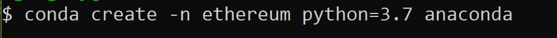  
  
6. Activate the environment:
  ```shell
  conda activate ethereum
  ```
  
   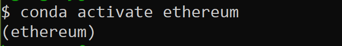 
 
 
### Create Two Nodes With Accounts
 
1. First, create accounts for two (or more) nodes with a separate `datadir` for each using `geth`:
    * Run the following two commands in the terminal (one after the other) and be sure you're in the Blockchain-Tools folder:
    ```bash
    ./geth --datadir node_1 account new
    ```
    ```bash
    ./geth --datadir node_2 account new
    ```
    
    * For each account you'll be asked to enter a password; __remember this password__!
    
    * ALSO, after confirming the password for each account, be sure to copy and save the public address of the key and the path of the secret key file. You'll need this to seal and pre-fund the accounts, then import the keystore file into MyCrypto laster on.
    
   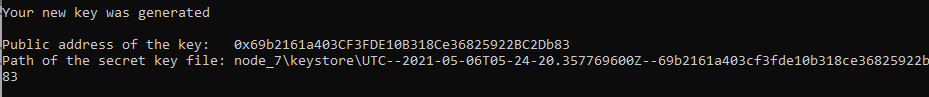    
    
 
### Run a Proof of Authority (PoA) Blockchain

2. Next, generate the genesis block:
   1. Open the terminal, navigate to the `Blockchain-Tools` folder, and type the following command:

```bash
./puppeth
```

* This should dsiplay the following:

 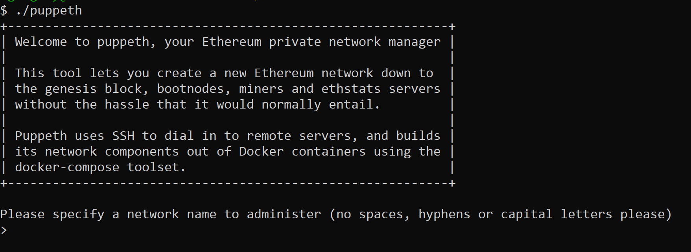

3. Type a name for your network, I used "flubbernet" but you can use any name, then hit enter to continue.

4. Type `2` to pick the `Configure new genesis` option, then `1` to `Create new genesis from scratch`:

  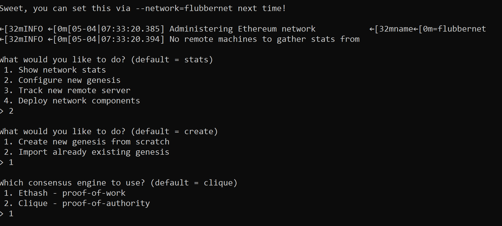

__Now you have the option to pick a consensus engine (algorithm) to use__

5. Type `2` to choose `Clique - proof-of-authority` and hit enter.

  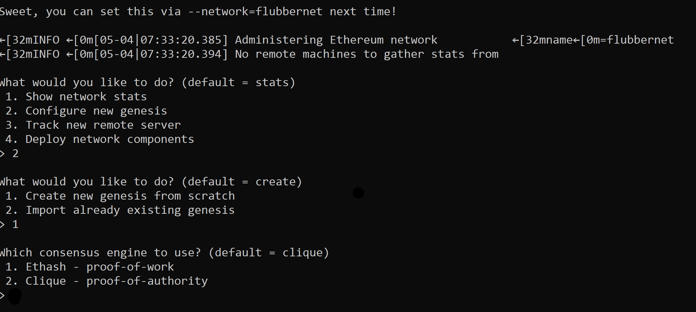

6. Hit Enter to skip "How many seconds should blocks take?"

  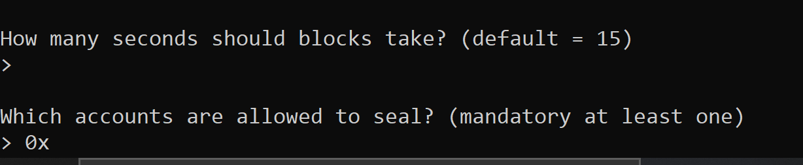

7. Paste both account addresses from the first step one at a time into the list of accounts to seal without the `0x` prefix.
    * Once you paste an address, hit enter, paste the second address and hit enter again. Hit Enter one more time on the blank `0x` address to continue.

8. Now you'll be asked to enter an account to pre-fund:
    * Paste the account addresses again to pre-fund. There are no block rewards in PoA, so you'll need to pre-fund.
  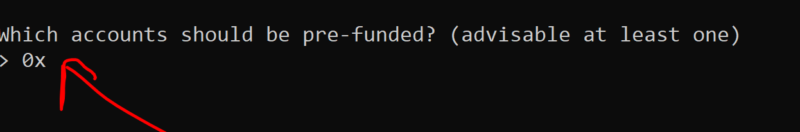
    
9. Type `no` for pre-funding the pre-compiled accounts (0x1 .. 0xff) with wei then hit Enter; this keeps the genesis cleaner.

  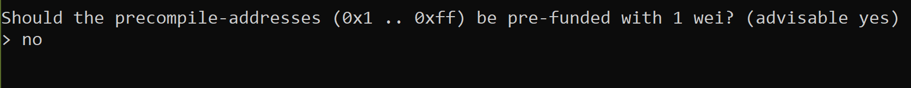

10. Specify a `Chain ID`:
    * Type in a random number to use as a chain ID, e.g. `12345`, then hit Enter (remember the chain ID).

  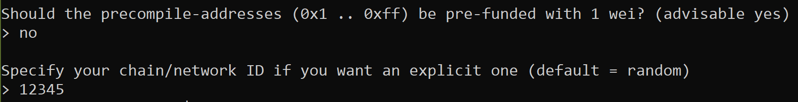

11. When you are back at the main menu, choose "Manage existing genesis" option:
    * Export the genesis configuration by typing `2`. This will fail to create two of the files, but you only need `<yournetworkname>.json`.

  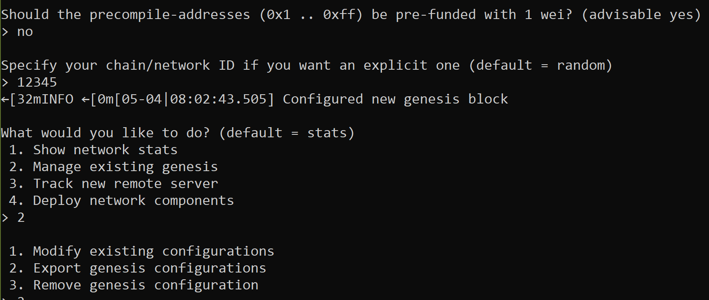

12. Exit `puppeth` by using the `Ctrl+C` keys combination.


### Initialize Nodes:

1. Using `geth`, initialize each node with the new `<yournetworkname>.json`:
    ```bash
    ./geth --datadir node_1 init <yournetworkname>.json
    ```
    ```bash
    ./geth --datadir node_2 init <yournetworkname>.json
    ```

2. Now the nodes can be used to begin mining blocks; run the nodes in separate terminal windows:
    2.1. Terminal 1: run node_1, unlock the account, and enable mining and the RPC flag. Only one node needs RPC enabled:
    ```bash
    ./geth --datadir node_1 --unlock "<SEALER_ONE_ADDRESS>" --mine --rpc --allow-insecure-unlock
    ```
     * Copy and save the enode address:

    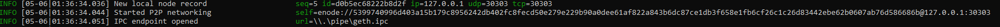
     
    2.2. Terminal 2: run node_2, set a different peer port than node_1 and use the first node's "enode" address as the "bootnodes" flag.
    ```bash
    ./geth --datadir node_2 --unlock "<SEALER_TWO_ADDRESS>" --mine --port 30304 --bootnodes "enode://<SEALER_ONE_ENODE_ADDRESS@127.0.0.1:30303>" --ipcdisable --allow-insecure-unlock
    ```
    
    **NOTE:** Type your password and hit enter even if you can't see it visually!

__Your private PoA blockchain should now be running___


### With Both Nodes Running, Add the Blockchain to MyCrypto to Test

1. Open the MyCrypto app, then click `Change Network` at the bottom left:

  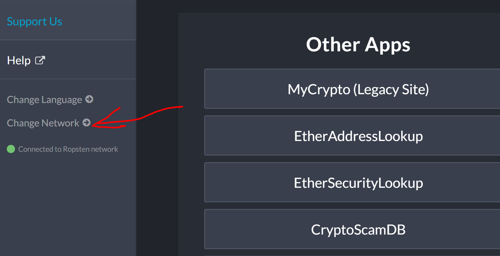 

2. Click "Add Custom Node", then add the custom network information that you set in the genesis.

    * Scroll down and choose `Custom` in the "Network" column to reveal more options like `Chain ID`:

  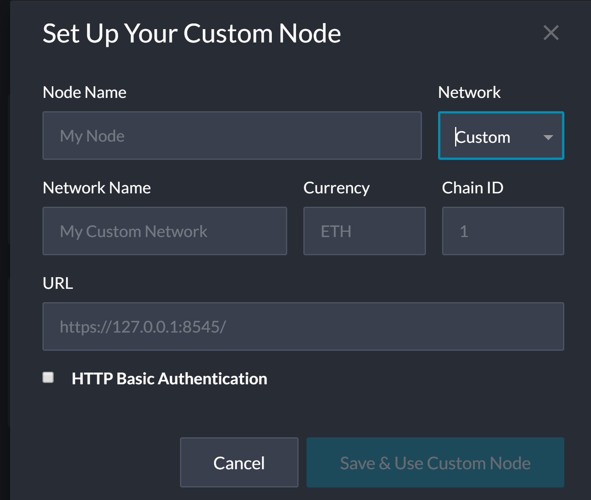 

3. Type `ETH` in the "Currency" box.
    
4. In the "Chain ID" box, type the chain id entered during genesis creation.

5. For "Node Name" and "Network Name", type the name you assigned to the network.

6. Type `http://127.0.0.1:8545` in the "URL" box to point to the default RPC port on your local machine.

6. Finally, click "Save & Use Custom Node". 


### Test the Network by Sending Money Between Accounts

1. Select the "View & Send" option at the top of the left menu, then click "Keystore file".

    

2. On the next screen, click "Select Wallet File" then navigate to the "keystore" folder inside the "node_1" folder. Select the file located there, provide your password when prompted, then click "Unlock".

    * This will open your account wallet inside MyCrypto. 
    
3. Send a transaction from the `node_1` account to the `node_2` account.

    * In the `To Address` box, type the public address of node_2 and enter in any amount of ETH:

     

4. Confirm the transaction by clicking "Send Transaction" then the "Send" button in the pop-up window.  

5. Click `Check TX Status` when the green message pops up and confirm logout:

    * You should see the transaction go from `Pending` to `Successful` in about 15 seconds (the default setting set in the genesis creation).

    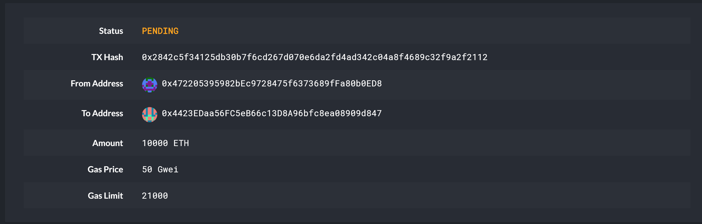

    * Click the `Check TX Status` button to refresh the status.


### Helpful Tips:

1. If you aren't seeing any movement in the wallet amounts in MyCrypto after sending/receiving transactions, try the following:
    * Terminate both nodes using control+C in the Node_1 and Node_2 terminal windows.
    * Change networks in MyCrypto to a Testnet such as Kovan.
    * Restart Node_1 and Node_2 in their terminal windows.
    * Reconnect to your network in MyCrypto.
    * Log into your wallet and refresh the amount.

2. If that doesn't help, make sure you are sending a large enough sum of ETH to see actual movement in the digits. You may have to click on the amount itself to see the full value down to the WEI.


### This Project was Built With:
This project is written in Python using Jupyter Notebook as well as the following tools:
* [Python](https://www.python.org/)
* [JupyterNotebook](https://jupyter.org/)
* [MyCrypto](https://www.mycrypto.com/) is a free, open-source, client-side interface that allows you to interact directly with the blockchain.
* [Puppeth](https://github.com/puppeth)
* [Go Ethereum](https://geth.ethereum.org/) is one of three original implementations of the Ethereum protocol. It is written in Go, open-source, and licensed under GNU LGPL v3.
   

### These tools are supported on Windows, MacOS, and Linux operating systems.


## Contact:
Blake Gregory - [LinkedIn](www.linkedin.com/in/blake-greg) - blake.gregory@tilineum.com